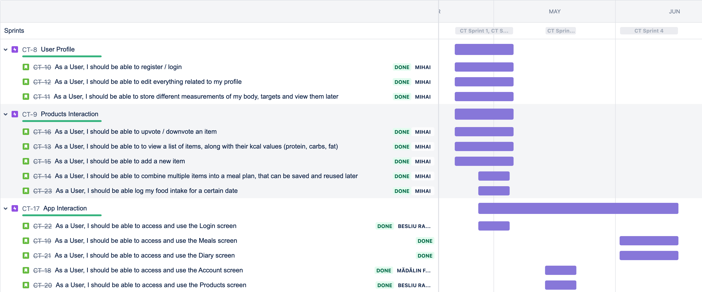
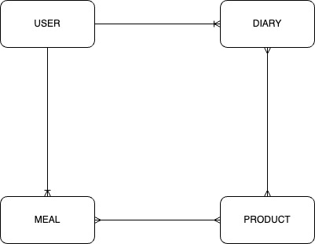
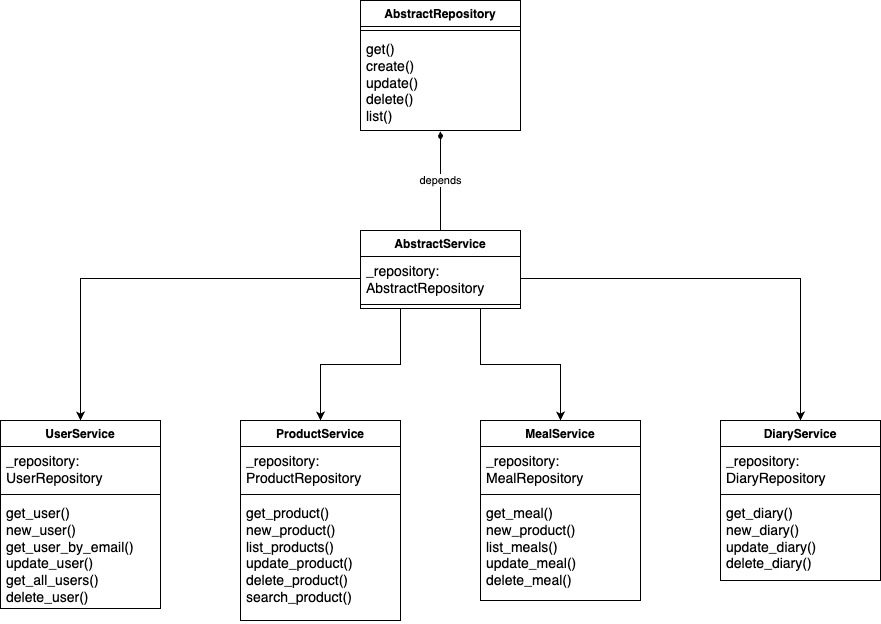
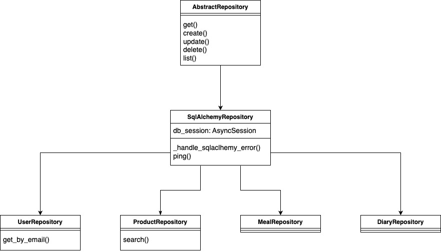

# Calorie Tracker App
The Calorie Tracker App is a mobile application developed by the team consisting of Beșliu Radu-Ștefan, Florea Mădălin-Alexandru, and Huțan Mihai-Alexandru. The app allows users to track their daily caloric intake and manage their nutrition goals. Users can register or login to their accounts and have the ability to edit their profile information. The app provides features such as storing body measurements and targets, upvoting or downvoting food items, and viewing a list of items along with their kcal values for protein, carbs, and fat.

Users can add new food items to the app's database and search for specific products. The app also enables users to create and customize meal plans by combining multiple food items. Users can log their food intake for a specific date and view a diary that shows their caloric consumption. They can add or remove individual food items or entire meals from the diary and edit any past or present entries.

In addition, the Calorie Tracker App offers a detailed caloric consumption pie chart, providing users with a visual representation of their nutrition breakdown. The app follows a user-centered approach, allowing users to access and utilize various screens such as Login, Home, Products, Meals, Diary, and Account.

The app's backend is built using Python and the FastAPI framework, with data stored in a PostgreSQL database. Docker is used for containerization, and GitHub Actions automates testing and deployment processes. The frontend is developed in JavaScript using React Native.

To ensure code quality and maintainability, the team followed coding standards such as PEP8 for Python and utilized tools like pre-commit, flake8, and GitHub Actions for linting, testing, and continuous integration. The team also employed design patterns such as the Repository Pattern to separate data access logic from business logic.

During development, the team utilized AI tools like GitHub Copilot and ChatGPT for assistance in writing code and performing error analysis. Bug reports were addressed through pull requests, and the codebase includes extensive comments to aid in code understanding.

Overall, the Calorie Tracker App provides a user-friendly and efficient way for individuals to track their caloric intake, manage their nutrition goals, and make informed decisions about their dietary habits.

## Team members
- Beșliu Radu-Ștefan
- Florea Mădălin-Alexandru
- Huțan Mihai-Alexandru

###  1. User Stories
01. As a User, I should be able to register / login.
02. As a User, I should be able to edit everything related to my profile.
03. As a User, I should be able to store different measurements of my body, targets and view them later.
04. As a User, I should be able to upvote / downvote an item.
05. As a User, I should be able to to view a list of items, along with their kcal values (protein, carbs, fat).
06. As a User, I should be able to add a new item.
07. As a User, I should be able to combine multiple items into a meal plan, that can be saved and reused later.
08. As a User, I should be able log my food intake for a certain date.
09. As a User, I should be able to access and use the Login screen.
10. As a User, I should be able to access and use the Meals screen.
11. As a User, I should be able to access and use the Diary screen.
12. As a User, I should be able to access and use the Account screen.
13. As a User, I should be able to access and use the Products screen.

### 2. Backlog
This is a link to the [backlog roadmap](https://mirama.atlassian.net/jira/software/projects/CT/boards/2/roadmap).

### 3. Features List
-  User can create an account
-  User can login
-  User can edit their profile
-  User can see all products
-  User can search for a product
-  User can add a product
-  User can upvote / downvote a product
-  User can create their meals
-  User can edit their meals
-  User can delete their meals
-  User can see diary for a specific date
-  User can add a meal to diary
-  User can remove individual meal products from diary
-  User can add products to diary
-  User can remove products from diary
-  User can edit any diary (past or present)
-  User can delete any of their diaries
-  User can view a piechart of their detailed caloric consumption
-  User can view the progress of their daily calories and target weight

 
### 4. UML Diagrams

#### 4.1. Database Conceptual Model

#### 4.2. Database ERD

#### 4.3. Services Diagram

#### 4.4. Repository Diagram

### 5. Git repositories
- [Frontend](https://github.com/RaduBesliu/calorie-tracker-mobile)
- [Backend](https://github.com/hutanmihai/calorie-tracker-backend)

### 6. Technologies used
- Frontend - JavaScript, React Native
- Backend - Python, FastAPI, PostgreSQL, Docker, GitHub Actions, Render, poethepoet

### 7. Automated tests
- For testing our backend we opted for an end-to-end testing approach. We used the [pytest](https://docs.pytest.org/en/6.2.x/) framework for writing and running our tests. We also used the [pytest-asyncio](https://pypi.org/project/pytest-asyncio/) plugin for writing async tests. In order to run our test we start a docker container with a non-persistent database and change the environment of our app using .env files. We also used the [pytest-cov](https://pypi.org/project/pytest-cov/) plugin for generating coverage reports.
- [Tests folder](https://github.com/hutanmihai/calorie-tracker-backend/tree/main/app/tests)

### 8. Refactoring & code standards

#### 8.1. Manual refactoring
- Refactored custom error schema [here](https://github.com/hutanmihai/calorie-tracker-backend/commit/21de61a914bdc6f1815dd1608d05e8ded627df6c)
- Refactored tests with new error schema [here](https://github.com/hutanmihai/calorie-tracker-backend/commit/572ffa25d919c48d2224f5f5c27a66701dbe08de)

#### 8.2. Code standards
- For the mobile part of the application, [Prettier](https://prettier.io/) was used. The configuration file for prettier can be seen [here](https://github.com/RaduBesliu/calorie-tracker-mobile/blob/main/.prettierrc.js).
- In backend we followed the [PEP8](https://www.python.org/dev/peps/pep-0008/) code style guide for Python. We made sure that every single line pushed to the repository follows the PEP8 guidelines by using the `pre-commit` tool which runs linters checkers for python code. Here are the [pre-commit configuration file](https://github.com/hutanmihai/calorie-tracker-backend/blob/main/.pre-commit-config.yaml) and the [flake8 file](https://github.com/hutanmihai/calorie-tracker-backend/blob/main/.flake8).
- Besides the pre-commit tool, we also used GitHub Actions to run the linters checkers for python code. Here is the [workflow file](https://github.com/hutanmihai/calorie-tracker-backend/blob/main/.github/workflows/main.yaml) for GitHub Actions.
- Inside the GitHub Actions, besides the linters, we also ran two more actions, one for running tests, and one for automated deployment on render.com.

### 9. Design Patterns
- We used the Repository Pattern for the backend. The repository pattern is a kind of container where data access logic is stored. It hides the details of data access logic from business logic. In other words, we can say that the repository pattern acts as an in-memory collection of entities where data access logic is stored.
- At some degree we can also consider our app a MVC app, as in our backend we have our model and controller layers represented by the [models](https://github.com/hutanmihai/calorie-tracker-backend/tree/0cb48baa4c8dcb6f1308b91f130d98885b34826f/app/models) and
the [APIs](https://github.com/hutanmihai/calorie-tracker-backend/tree/0cb48baa4c8dcb6f1308b91f130d98885b34826f/app/apis). Our view layer is represented by the frontend.

### 10. AI Tools used in development
- During the development of the project, we used [GitHub Copilot](https://github.com/features/copilot) which was mostly used for writing repetitive lines of code. One example would be the custom errors [here](https://github.com/hutanmihai/calorie-tracker-backend/blob/main/app/services/errors.py) and [here](https://github.com/hutanmihai/calorie-tracker-backend/blob/main/app/repositories/errors.py).
- We also used [ChatGPT](https://chat.openai.com/) for different types of error analysis and other short questions that normally would've been asked on [Stack Overflow](https://stackoverflow.com/).

### 11. Bug reports fixed with pull requests
- [Bugfix solved with pull request](https://github.com/RaduBesliu/calorie-tracker-mobile/issues/9)

### 12. Commented code
- Most of the frontend code is commented. [Here](https://github.com/RaduBesliu/calorie-tracker-mobile/blob/main/src/providers/AuthProvider/index.tsx) and [here](https://github.com/RaduBesliu/calorie-tracker-mobile/blob/main/src/api/index.tsx) you can find some examples.

## Backend Documentation
- [Readme](https://github.com/hutanmihai/calorie-tracker-backend/blob/main/README.md)
- [PDF](https://github.com/hutanmihai/calorie-tracker-backend/blob/main/MDSBackendDocumentation.pdf)
- [Swagger](https://calorietracker.eu/docs)
