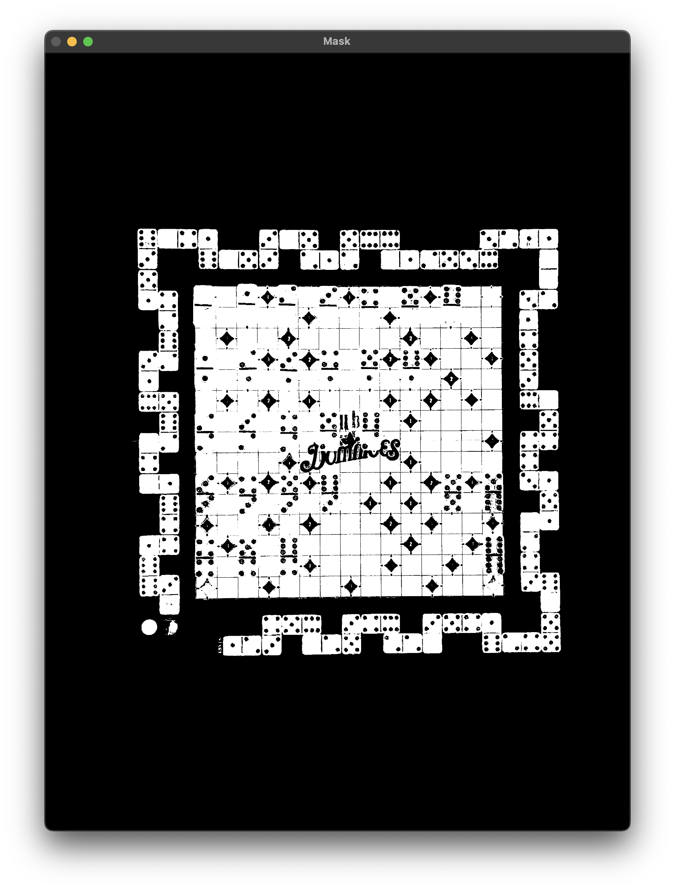

# Computer Vision - Double Double Dominoes

## Author

- Hutan Mihai Alexandru
- Github: [hutanmihai](https://github.com/hutanmihai)
- LinkedIn: [Mihai-Alexandru Hutan](https://www.linkedin.com/in/hutanmihai/)
- Portfolio: [mihaihutan.ro](https://mihaihutan.ro)

## The problem statement can be found here: [Problem.pdf](./Problem.pdf)

## Description

Implemented a computer vision system for automated dominoes game analysis. The project involves three main steps: board extraction, piece detection, and classification.
- Board extraction includes HSV masking, preprocessing, edge detection, and contour identification.
- Piece detection addresses challenges such as center text interference and misplacement.
- Classification utilizes templates for both vertical and horizontal domino pieces, employing template matching with preprocessing for accurate results.
- The final component, score calculation, involves dynamic programming considering player positions on the score board.

You can run it by following the instructions described below, and see the documentation [here](#documentation)
or [here](./documentation.pdf).

## Required Libraries

python=3.11.5
opencv-python==4.8.1.78
numpy==1.26.0

## How to run the project

### 1. Install required libraries

#### Install required libraries using conda

This is the recommended way of installing the required libraries.

```bash
conda create --name computer-vision-project-1 python=3.11.5
conda activate computer-vision-project-1
pip install opencv-python==4.8.1.78
pip install numpy==1.26.0
```

#### Install required libraries using pip

Make sure you have python 3.11.5 installed on your system and you are using it.

```bash
pip install opencv-python==4.8.1.78
pip install numpy==1.26.0
```

### 2. Set the constants

Setup the constants in the `src/constants.py` file.
Please only change the values of the constants and do not change their names.

Optional constants that can be set to `True` or `False` depending on what you want to visualize.
If none of them are set to `True` then the program will not display any images.
If all of them are set to `True` then the program will display all the images but it will take a while to go through
them all.

```python
SHOW_BOARD_EXTRACTION_POINTS = False
SHOW_BOARD_LINES = False
SHOW_PATCHES = False
SHOW_TEMPLATES_ON_GENERATION = False
SHOW_PATCHES_PREPROCESSING = False
SHOW_DETECTED_PIECES = False
SHOW_BOARD_EXTRACTION_STEPS = False
SHOW_AUGMENTATION_STEPS = False
```

### 3. Set the PYTHONPATH

Make sure you are in the root directory of the project.

- Windows - Powershell:

```bash
$env:PYTHONPATH='.' 
```

- Windows - CMD:

```bash
set PYTHONPATH=.
```

- Linux / MacOS:

```bash
export PYTHONPATH=.
```

### 4. Run the project

```bash
python src/main.py
```

For evaluation if the mode you used was train run the following command:

```bash
python src/eval_train.py
```

To change from train to test mode change the following line in `src/constants.py`:

```python
MODE = "train"  # "train" or "test"
```

To run the train data and augment it change the following line in `src/constants.py`:

```python
AUGMENT_DATA = True  # True or False
MODE = "train"
```

For evaluation if the mode you used was test run the following command:

```bash
python src/eval_test.py
```

## Documentation

The problem comes down to only three steps, detection, classification and score calculation, all these steps are explained in depth in the following sections.

### 1. Detection

### 1.1. Board Extraction

#### 1.1.1. Approach
For detection part we can see two major steps that we need to do before continuing solving the problem. We have a lot of unnec- essary data, the table that the board is placed on, and the score board.

The score board is unnecessary because in the test image the players are not moved anymore, therefore we can not use that part of the board to calculate the score in section 4.


#### 1.1.2 Steps
All parameters values presented in the following steps were found by trial and error, and visualization logic while debugging.

All these steps can be visualized in the following images.


- HSV Mask
    - For Board Extraction the main idea is to use an HSV mask to remove parts of the image that are not of interest.
    - The HSV values found are (80, 0, 0) and (102, 255, 255).



- Preprocessing
    - In the image of the mask, there is quite a bit of noise. Therefore we reduce it using both median and gaussian blur to get a sharpened version of the original image.
    - We threshold the image intro a binary image.
    - We use morphological operations to erode and then dilate the image.


- Edge Detection
    - We use Canny for edge detection on the preprocessed image.


- Contours
    - We find the contours.


- Find Extreme Points In Contours
    - We use a function to find the topleft, topright, bottomleft, and bottomright points in the image.


- Warp
    - We use warpPerspective from opencv to get our board from the image and resize it to 1500x1500px, each box in the board being 100x100px.


### 1.2 Piece Detection
- The core idea is to use the same mask as before and get each patch at a time, calculate the mean value of the pixels and use a threshold to detect if there is a piece of domino or not.
- We’ve faced two main problems here, the center of the board appears in the mask, (the text of Double Double Dominoes is white therefore appears in the mask) and some pieces are not placed correctly, therefore the black pixels from the board appear in the image influencing the mean.
- The center text problem is solved by using template matching. I’ve created templates from the auxiliary images with each patch of the center text, and if they match we ignore that when detecting. The created templates can be visualized in the following images.


- The bad placed dominoes problem I’ve solved by not using the entire patch, but removing 15 pixels from each side, remaining with a 70x70px patch.
- The way we create the mask and use it in our algorithm to calculate mean and detect pieces can be visualized in the following images.


## 2. Classification

### 2.1. Templates Creation

For template creation I used a programatic approach, to remove human error. I hardcoded the places on both the vertical and horizontal auxiliary images.


Using the board extraction function explained in section 2.1. I parse the board and whenever I find a place of interest, I know the patch true value, and add it in a list corresponding to its value. (I create templates for both vertical and horizontal placed pieces since domino piece number 3 for example is different depending on the direction it is placed).

After saving multiple templates for each domino piece both vertically, and horizontally, I generate the mean image for each direction and value, and save them in a folder for future use.

Some examples of the generated templates can be visualized in the following images.


### 2.2 Template Matching
For template matching we use the matchTemplate function from opencv with TM COEFF NORMED.

The main trick for good results is to preprocess the patches. We remove noise, try to remove the lines and board from bad placed pieces, also preprocess the templates, and then call the template matching function.


The templates preprocessing result is also represented in the following images:


The preprocess result on extracted patches from the table can be visualized in the following images:


### 3. Score Calculation
For score calculation, once the detection and classification work well, there is only a simple dynamic programming approach.

Since the score is related to the current position of each player on the score board (aka. their total score) we must save that data constantly at each step. On each move we calculate the current score of the player moving the piece by checking the hardcoded bonus values from the tables, by checking if it is a double piece (3,3 / 6,6 etc.) and by checking for both players if the value placed is the same as their current position on the score board.

