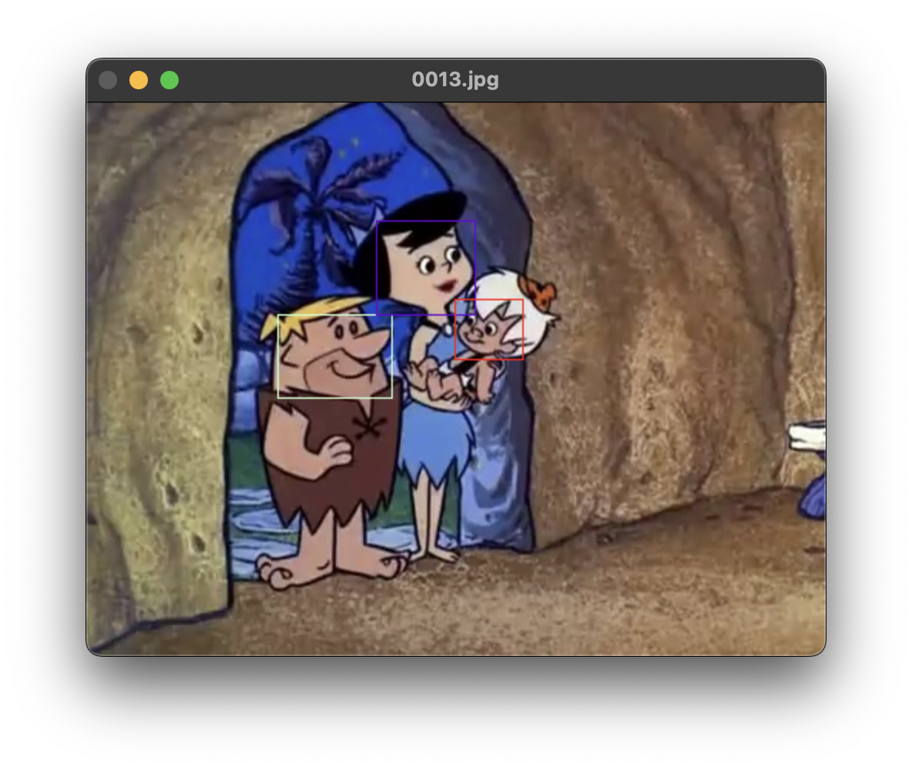

# Computer Vision - Project 2 - The Flinstones Facial Detection & Recognition

## Author

- Hutan Mihai Alexandru
- Github: [hutanmihai](https://github.com/hutanmihai)
- LinkedIn: [Mihai-Alexandru Hutan](https://www.linkedin.com/in/hutanmihai/)
- Portfolio: [mihaihutan.ro](https://mihaihutan.ro)

## The problem statement can be found here: [Problem.pdf](./Problem.pdf)

## Description

🪨 Sliding window approach, using CNNs as classifiers for facial detection and recognition in "The Flinstones" 🪨

You can run it by following the instructions described below, and see the documentation [here](#documentation)
or [here](./documentation.pdf).




## Required Libraries

python=3.11.5
numpy==1.26.3
opencv-python==4.9.0.80
matplotlib==3.8.2
scikit-image==0.22.0
jupyter==1.0.0
torch==2.1.2
torchvision==0.16.2

## How to run the project

### 1. Install required libraries using conda and pip

This is the recommended way of installing the required libraries.
You can also not use conda and install the libraries using pip, but you will have to make sure that you have the correct
version of python installed (3.11.5).

```bash
conda create --name computer-vision-project-2 python=3.11.5
conda activate computer-vision-project-2
pip install numpy==1.26.3 opencv-python==4.9.0.80 matplotlib==3.8.2 scikit-image==0.22.0

# If you have a CUDA enabled GPU (Windows)

pip install torch==2.1.2 torchvision==0.16.2 --index-url https://download.pytorch.org/whl/cu121

# If you have a CUDA enabled GPU (Linux) / MacOS (CPU) / Windows (CPU)

pip install torch==2.1.2 torchvision==0.16.2

# If you want to train the networks, otherwise you can skip this step and they will be loaded from the models/ folder.

pip install jupyter==1.0.0

```

### 2. Set the PYTHONPATH

Make sure you are in the root directory of the project.

- Windows - Powershell:

```bash
$env:PYTHONPATH='.' 
```

- Windows - CMD:

```bash
set PYTHONPATH=.
```

- Linux / MacOS:

```bash
export PYTHONPATH=.
```

### 3. (Optional) Train the networks

- If you want to train the networks, you first need to run `collapse()` and `extract_train_and_validation_patches()`.
  This will create the training and validation patches.
- `Note:` These will take somewhere between 30 seconds to 4 minutes depending on your machine.

```bash
python src/pre_training.py
```

- Then you can run the jupyter notebooks `task1_cnn.ipynb` and `task2_cnn.ipynb` to train the networks.
- `Note:` Task1 took me 30 minutes to train on a RTX3070 and Task2 took me about 5 minutes to train on the same GPU. If
  you don't have a powerful GPU or none at all, it will take a lot longer.
- The models will overwrite the ones in the models/ folder, therefore your results might be different from the ones in
  the report.

### 4. Run the project

- `Note:` Task1 took me about 2 hours to run on a RTX3070 and an I5-14600KF. If you don't have a powerful GPU or none at
  all, it will take a lot longer.
- Task2 runs really fast, because we use the results from task1, so be sure to run task1 first.

To run task1 on the test images run the following command, but if you want to run it on the validation images, just
remove the test flag.

```bash
python src/task1.py --test
```

For task2 run the following command, but if you want to run it on the validation images, just remove the test flag.

```bash
python src/task2.py --test
```

### 5. (Optional) Run the tests

By default the evaluation script runs on test data, if you want to run it on validation data, you must change the paths.

```bash
python src/eval.py
```

### 6. (Optional) Visualize the results for validation data

```bash
python src/visualize_results.py
```

## Documentation

This project revolves around three main steps: patch extraction, classification, and detection. These steps are
comprehensively explained in the following sections.

### 1. Patch Extraction

### 1.1. Approach

Upon analyzing the ground truth detection, it was observed that faces are mostly detected as squares, typically with a
width and height of 80px. To simplify the implementation, I opted for 40px patches, aiming to downscale the images
efficiently during implementation using a sliding window approach.

### 1.2. Positives

The process for handling positives is straightforward: parsing the ground truth annotations and images to extract
patches. These patches are resized to 40x40px, and both the original and flipped variants are saved for additional data.
I experimented with a minor tweak ignoring small detections with an area of less than 400 in the original image, but it
didn’t yield significant improvements.


### 1.3. Negatives

For negative patches, I pursued a random approach, generating random xmin and ymin coordinates and calculating xmax and
ymax by adding 40. To ensure non-overlap with any ground truth detection, strict avoidance measures were taken.

Additionally, I saved 50 negatives for each ground truth detection, which is further detailed in the binary
classification section.


## 2. Classification

### 2.1. Approach

For both tasks, Convolutional Neural Networks (CNNs) were chosen. Initially, attempts with hog descriptors didn’t exceed
an average precision of 0.550 for task1. Task1 employed a binary classifier, while task2 utilized a multi-class
classifier, both described in detail below.

### 2.1. Binary Classification

The binary classifier involved minimal preprocessing: converting patches to grayscale images. This choice aimed to avoid
poten- tial color-based false positives and encourage the network to focus more on lines. Normalizing pixel values
between 0 and 1 was also performed by dividing each by 255.

Initial attempts with a small CNN yielded good validation results (more than 0.99 accuracy), but practical application
with the slid- ing window revealed numerous false positives. To address this, the network was intentionally overfitted
on the training images, lever- aging the nearly identical appearance of characters. This overfit- ting was achieved by
employing a considerably more complex CNN architecture and providing over 300k negative examples to counter the data
imbalance. This deliberate bias towards classifying as neg- ative aligned with the sliding window approach where most
sent images are negatives.

```python
model = Sequential(
    # Input: 1x40x40
    nn.Conv2d(in_channels=1, out_channels=16, kernel_size=3, padding=1),
    nn.ReLU(),
    nn.MaxPool2d(2, 2),
    nn.Conv2d(in_channels=16, out_channels=32, kernel_size=3, padding=1),
    nn.ReLU(),
    nn.MaxPool2d(2, 2),
    nn.Conv2d(in_channels=32, out_channels=64, kernel_size=3, padding=1),
    nn.ReLU(),
    nn.MaxPool2d(2, 2),
    nn.Conv2d(in_channels=64, out_channels=64, kernel_size=3, padding=1),
    nn.ReLU(),
    nn.MaxPool2d(2, 2),
    nn.Flatten(),
    nn.Dropout(0.25),
    nn.Linear(256, 256),
    nn.ReLU(),
    nn.Dropout(0.25),
    nn.Linear(256, 1),
    nn.Sigmoid(),
).to(device)
```

The network achieved over 0.99 accuracy on both test and vali- dation sets. Optimizer: Adam; learning rate: 1e-4; loss
function: binary cross-entropy; batch size: 64.

### 2.2. Multi-Class Classification

Preprocessing involved converting patches from BGR to RGB, and normalizing pixels between 0 and 1. Ground truth labels
were mapped to integers, resulting in five classes. The architecture for the multi-class classifier is almost the same
as the binary classi- fier, for similar reasons, forced overfitting. The only change being that we use 3 channels
images (RGB) and changed the sigmoid activation function to softmax.

```python
model = Sequential(
    # Input: 3x40x40
    nn.Conv2d(in_channels=3, out_channels=16, kernel_size=3, padding=1),
    nn.ReLU(),
    nn.MaxPool2d(2, 2),
    nn.Conv2d(in_channels=16, out_channels=32, kernel_size=3, padding=1),
    nn.ReLU(),
    nn.MaxPool2d(2, 2),
    nn.Conv2d(in_channels=32, out_channels=64, kernel_size=3, padding=1),
    nn.ReLU(),
    nn.MaxPool2d(2, 2),
    nn.Conv2d(in_channels=64, out_channels=64, kernel_size=3, padding=1),
    nn.ReLU(),
    nn.MaxPool2d(2, 2),
    nn.Flatten(),
    nn.Dropout(0.25),
    nn.Linear(256, 256),
    nn.ReLU(),
    nn.Dropout(0.25),
    nn.Linear(256, 5),
    nn.Softmax(1),
).to(device)
```

The network achieved over 0.99 accuracy on both test and validation sets. Optimizer: Adam; learning rate: 1e-4; loss
function: cross-entropy loss; batch size: 64.

## 3. Detection

### 3.1. Sliding Window

The sliding window employed a 40x40px window with a stride of 2 and various downscale factors (0.9, 0.5, and 0.3) to
accommodate faces of different sizes. Post-cnn processing included applying a threshold of 0.9 for predictions and
non-maximal suppression (0.1 IoU threshold) to finalize confident detections. Task2 utilized results from Task1, passing
detections to the multi-class CNN classifier for character classification.

## 4. Results

We measure the performance of our approach using the mean average precision metric. The results are presented in the
following images:


For task 2, we measure the mean average precision for each character, and the results are presented in the following
images:


