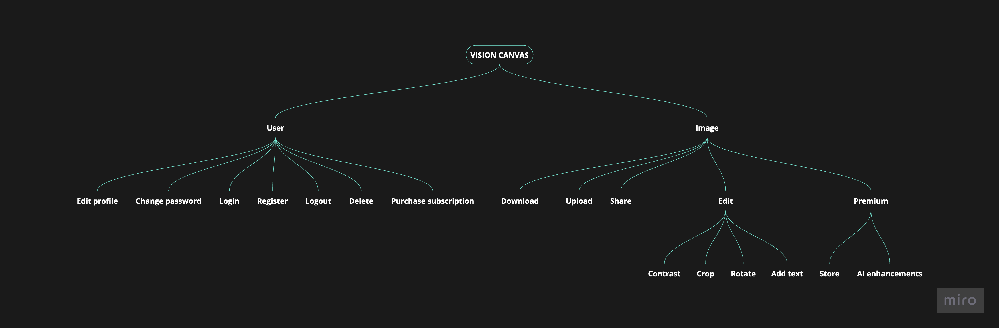
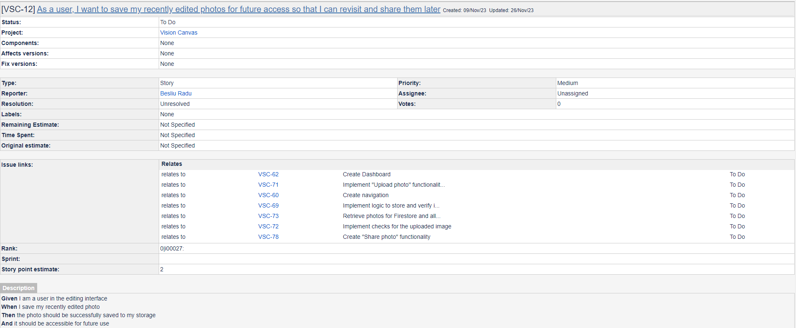

# Vision Canvas - Web Based Photo Editor

## Team Members

- [Beșliu Radu-Ștefan](https://github.com/RaduBesliu)
- [Florea Mădălin-Alexandru](https://github.com/madalin1907)
- [Gheorghe Robert-Mihai](https://github.com/surtexx)
- [Huțan Mihai-Alexandru](https://github.com/hutanmihai)

## Project Overview

### Product Vision

- Our Web Photo Editor is designed to be a **user-friendly and versatile tool**, catering to a wide range of users from meme enthusiasts to content creators, and businesses. It aims to **simplify the photo editing process** with a suite of **powerful yet accessible features**. The app will be free to use, with a premium subscription offering additional functionalities.

- Our app is designed to offer a **comprehensive suite of editing tools**, ensuring users can transform their photos effortlessly. Key features include:

  - **Blur Enhancement**: This feature allows users to add depth to their images through various blur options, enhancing the focus and adding a creative touch to their photos.
  - **Text Addition**: Users can easily add text to their images, choosing from a variety of fonts, styles, and positions. This is ideal for adding captions, quotes, or watermarks.
  - **Contrast Adjustment**: This tool enables users to adjust the contrast in their photos, enhancing details and creating more visually striking images.
  - **Background Removal**: Our advanced background removal tool allows users to easily separate subjects from their backgrounds, offering professional results without the need for complex editing skills.
  - **Object Removal**: Users can remove unwanted elements from their photos, ensuring a clean and polished look.

- The app is designed with a user-friendly interface, incorporating **machine learning algorithms** for automated enhancements. It stands out by balancing powerful features with simplicity, making it suitable for **users at all skill levels**.

- Our goal is for the app to be recognized as the go-to lightweight web photo editor, known for its comprehensive features and ease of use.

- Launch and Development:

  - The initial version is set to launch in the next 3 months.
  - We will adopt a continuous improvement model, integrating user feedback and expanding features.
  - Initially, the app will support desktop browsers and be compatible with major operating systems.
  - A mobile-optimized version for tablets and smartphones is planned for subsequent phases.

- Success Metrics:
  - We will measure the app's success by the number of active users and the count of active premium subscriptions.
  - This approach ensures that our Web Photo Editor not only meets the current editing needs of a diverse audience but also evolves with user feedback and technological advancements.

### Product Features & Functionalities

- Mind Map:
  

- Roadmap:
  

- Integration points:
  

### Non-functional Requirements

### Customer Journey

- User Personas:
  
  

- User Journey Map:
  

### Activity Diagram

### User Stories

### Product Backlog

### Sprints

