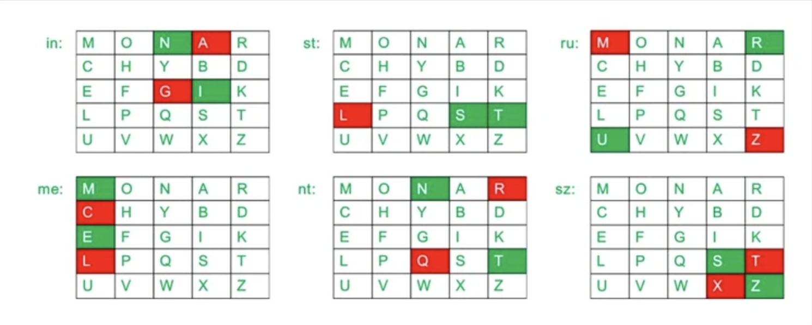
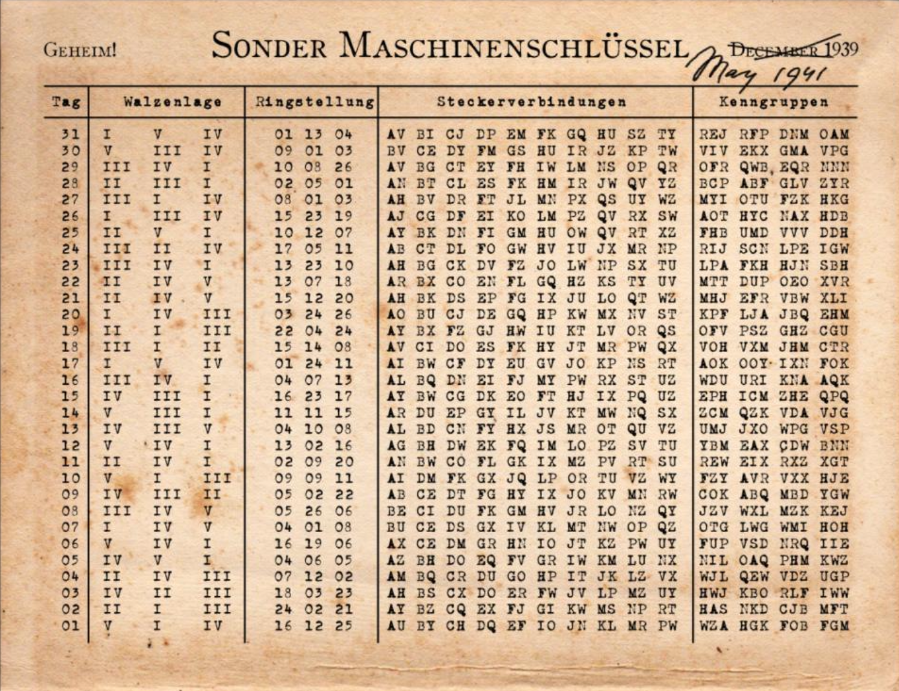
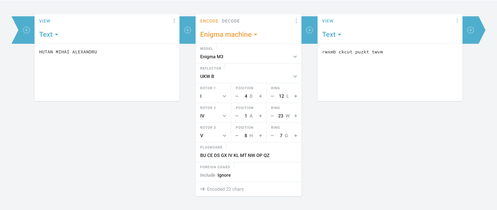
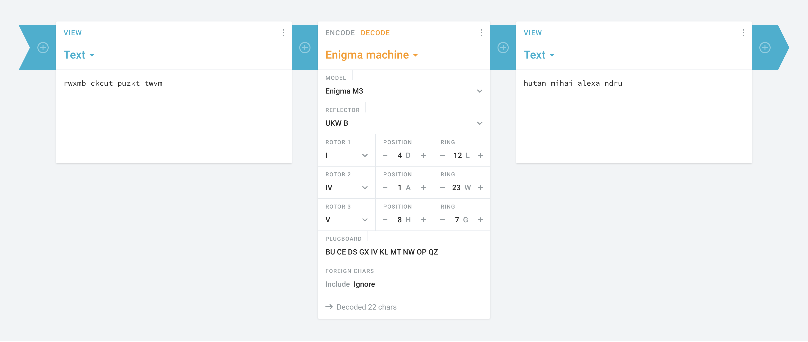

# - Laboratorul 3 -

## One Time Pad (OTP), sisteme de criptare istorice, Enigma

### 1. One Time Pad (OTP)

1. Primiți mesajul criptat următor, în format Base64:

 ```
o9/khC3Pf3/9CyNCbdzHPy5oorccEawZSFt3mgCicRnihDSM8Obhlp3vviAVuBbiOtCSz6husBWqhfF0Q/8EZ+6iI9KygD3hAfFgnzyv9w== 
 ```

Știți despre acesta că a fost criptat cu cheia secretă următoare, reprezentată în hex:

 ```
ecb181a479a6121add5b42264db9b44b4b48d7d93c62c56a3c3e1aba64c7517a90ed44f8919484b6ed8acc4670db62c249b9f5bada4ed474c9e4d111308b614788cd4fbdc1e949c1629e12fa5fdbd9 
 ```

Decriptați. Care este mesajul clar primit?

- Intai transformam textul din base64 in hex:

```
o9/khC3Pf3/9CyNCbdzHPy5oorccEawZSFt3mgCicRnihDSM8Obhlp3vviAVuBbiOtCSz6husBWqhfF0Q
/8EZ+6iI9KygD3hAfFgnzyv9w==
to
a3dfe4842dcf7f7ffd0b23426ddcc73f2e68a2b71c11ac19485b779a00a27119e284348cf0e6e1969defbe2015b816e23ad092cfa86eb015aa85f17443ff0467eea223d2b2803de101f1609f3caff7
```

- Facem XOR intre cheie si textul in hex:

```
4f6e652054696d6520506164206573746520756e2073697374656d20646520637269707461726520706572666563742073696775722064616361206573746520666f6c6f73697420636f726563742e
```

- Transformam rezultatul din hex in ASCII:

```
One Time Pad este un sistem de criptare perfect sigur daca este folosit corect.
```

2. Există o cheie care ar fi decriptat același text criptat de la pct.1 în textul clar următor?
   Care este această cheie? (Atentie! Nu se folosesc diacritice.)

```Orice text clar poate obtinut dintr-un text criptat cu OTP dar cu o alta cheie. ```

- Initial transformam textul de mai sus in hex:

```
4F72696365207465787420636C617220706F617465206F6274696E75742064696E74722D756E20746578742063726970746174206375204F545020646172206375206F20616C74612063686569652E
```

- Facem XOR intre textul in hex si textul criptat de la punctul 1 si obtinem cheia cautata:

```
ecad8de748ef0b1a857f032101bdb51f5e07c3c37931c37b3c3219ef748215708cf046a18588c1e2f897ca0076ca7f924eb1e6efcb1b905afed5d110228d24049b824cf2d3ec4980219208fa55cad9
```

3. Ce impact are refolosirea cheii de la punctul 1 pentru o altă criptare?

- Daca un atacator are acces la un mesaj criptat si la mesajul clar, atunci poate afla cheia si respectiv toate mesajele
  criptate cu aceeasi cheie.

### 2. Sisteme de criptare istorice

1. Alegeți un sistem istoric de criptare care folosește metoda substituției. Dați un exemplu de criptare și un exemplu
   de decriptare, explicând cum funcționează. Ce puteți spune despre securitatea sistemului de criptare? Ce tehnici de
   criptanaliză ați putea folosi pentru a sparge sistemul?

- CIFRTUL ATBASH
- A fost folosit în perioada antică ebraică și presupune înlocuirea fiecărui caracter cu cel aflat pe poziția sa opusă
  într-un alfabet dat.
- Exemplu de criptare:

```
HUTAN MIHAI ALEXANDRU -> SFGZM NRSZR ZOVCZMWIF
```

- Exemplu de decriptare:

```
HVXFIRGZGVZ HRHGVNVOLI RMULINZGRXV -> SECURITATEA SISTEMELOR INFORMATICE
```

- Tool folosit: https://planetcalc.com/2797/
- Securitatea sistemului este destul de slaba deoarece este expusa la atacuri de tipul brute force si analiza de
  frecventa.
- Daca alfabetul este cunoscut, atunci sistemul poate fi spart prin brute force.
- Daca alfabetul nu este cunoscut, atunci sistemul poate fi spart prin analiza de frecventa.

2. Alegeți un sistem istoric de criptare care folosește metoda transpoziției. Dați un exemplu de criptare și un exemplu
   de decriptare, explicând cum funcționează. Ce puteți spune despre securitatea sistemului de criptare? Ce tehnici de
   criptanaliză ați putea folosi pentru a sparge sistemul?

- CIFRUL PLAYFAIR
- Cifrul Playfair este o metodă de criptare inventată de Lord Playfair în secolul al XIX-lea. Acesta implică
  transformarea perechilor de litere într-un text clar într-un alt set de perechi de litere folosind o matrice specială,
  numită "tabloul Playfair".
- Tabloul Playfair este o matrice de 5x5 litere, care este folosită pentru a stabili perechile de litere înlocuite.
  Literele alfabetului se așează în tabel cu excepția unei litere care este ignorată (de obicei, se exclude litera 'J'
  sau 'Q'). De asemenea, se elimină literele duplicate din textul clar.

- Exemplu de tablou Playfair:
  

- Exemplu de criptare:

```
key = monarchy
instruments -> gatlmzclrqtx
```

- Exemplu de decriptare:

```
key = monarchy
gatlmzclrqtx -> instruments
```

- Securitatea sistemului este destul de slaba deoarece este expusa la atacuri de tipul brute force si analiza de
  frecventa.
- Metode de atac:
- Analiza frecvenței: Poți încerca să analizezi frecvența apariției perechilor de litere. Anumite perechi de litere sunt
  mai comune decât altele în limba engleză și pot oferi indicii despre literele pe care ar putea să le reprezinte.
- Analiza digrafelor: Poți căuta combinațiile de două litere care se repetă frecvent și încerca să le deduci folosind
  cunoștințele despre limba engleză.
- Atacul cunoscut-plaintext: Dacă aveți un fragment de text clar și criptat, puteți încerca să deduceți cheia folosită.

### 3. Analiza de frecvență

- Textul următor este criptat cu un sistem de substituție monoalfabetic:

```
ENHFJ  EWK  LML  EOJ  GDJ  BMONKC  PMCG  YEPMAC  FOVQGMROEQDHF  FMAQNJ.  CHWFJ GDJHO  HWUJWGHMW  HW  1978,  GDJV  DEUJ  EG  MWFJ  LJJW  FENNJK  HWCJQEOELNJ,  EWK DEUJ LJJW GDJ CALXJFG MY WAPJOMAC KHUMOFJC, GOEUJNC, EWK GMOPJWGC. HW GDJ JWCAHWR VJEOC, MGDJO FDEOEFGJOC DEUJ XMHWJK GDJHO FOVQGMROEQDHF YEPHNV. GDJOJC JUJ, GDJ QECCHUJ EWK CALPHCCHUJ JEUJCKOMQQJO, PENNMOV GDJ PENHFHMAC EGGEFTJO, EWK GOJWG, GOACGJK LV ENN, XACG GM WEPJ E YJB. BDHNJ ENHFJ, LML, EWK GDJHO  JSGJWKJK  YEPHNV  BJOJ  MOHRHWENNV  ACJK  GM  JSQNEHW  DMB  QALNHF  TJV FOVQGMROEQDV  BMOTC,  GDJV  DEUJ  CHWFJ  LJFMPJ  BHKJNV  ACJK  EFOMCC  MGDJO CFHJWFJ  EWK  JWRHWJJOHWR  KMPEHWC.  GDJHO  HWYNAJWFJ  FMWGHWAJC  GM  ROMB MAGCHKJ MY EFEKJPHE EC BJNN: ENHFJ EWK LML EOJ WMB E QEOG MY RJJT NMOJ, EWK CALXJFG  GM  WEOOEGHUJC  EWK  UHCAEN  KJQHFGHMWC  GDEG  FMPLHWJ  QJKERMRV BHGD  HW-XMTJC,  MYGJW  OJYNJFGHWR  MY  GDJ  CJSHCG  EWK  DJGJOMWMOPEGHUJ JWUHOMWPJWGC HW BDHFD GDJV BJOJ LMOW EWK FMWGHWAJ GM LJ ACJK. PMOJ GDEW XACG  GDJ  BMONKC  PMCG  YEPMAC  FOVQGMROEQDHF  FMAQNJ,  ENHFJ  EWK  LML  DEUJ LJFMPJ EW EOFDJGVQJ MY KHRHGEN JSFDEWRJ, EWK E NJWC GDOMARD BDHFD GM UHJB LOMEKJO KHRHGEN FANGAOJ. I.KAQMWG EWK E.FEGGEQEW FOVQGMFMAQNJ
```

- Folosiți analiza de frecvență ca să determinați textul clar. Acesta este în limba engleză.
- Site folosit pentru rezolvare: https://scottbryce.com/cryptograms/

```
ALICE AND BOB ARE THE WORLDS MOST FAMOUS CRYPTOGRAPHIC COUPLE. SINCE THEIR INVENTION IN 1978, THEY HAVE AT ONCE BEEN CALLED INSEPARABLE, AND HAVE BEEN THE SUBJECT OF NUMEROUS DIVORCES, TRAVELS, AND TORMENTS. IN THE ENSUING YEARS, OTHER CHARACTERS HAVE JOINED THEIR CRYPTOGRAPHIC FAMILY. THERES EVE, THE PASSIVE AND SUBMISSIVE EAVESDROPPER, MALLORY THE MALICIOUS ATTACKER, AND TRENT, TRUSTED BY ALL, JUST TO NAME A FEW. WHILE ALICE, BOB, AND THEIR EXTENDED FAMILY WERE ORIGINALLY USED TO EXPLAIN HOW PUBLIC KEY CRYPTOGRAPHY WORKS, THEY HAVE SINCE BECOME WIDELY USED ACROSS OTHER SCIENCE AND ENGINEERING DOMAINS. THEIR INFLUENCE CONTINUES TO GROW OUTSIDE OF ACADEMIA AS WELL: ALICE AND BOB ARE NOW A PART OF GEEK LORE, AND SUBJECT TO NARRATIVES AND VISUAL DEPICTIONS THAT COMBINE PEDAGOGY WITH IN-JOKES, OFTEN REFLECTING OF THE SEXIST AND HETERONORMATIVE ENVIRONMENTS IN WHICH THEY WERE BORN AND CONTINUE TO BE USED. MORE THAN JUST THE WORLDS MOST FAMOUS CRYPTOGRAPHIC COUPLE, ALICE AND BOB HAVE BECOME AN ARCHETYPE OF DIGITAL EXCHANGE, AND A LENS THROUGH WHICH TO VIEW BROADER DIGITAL CULTURE. Q.DUPONT AND A.CATTAPAN CRYPTOCOUPLE
```

### 4. Sistemul de criptare mecanic Enigma

1. Preluați cheia zilei din o carte a codurilor disponibilă precum aceasta .

2. Setați cheia zilei în simulatorul Enigma.

- Am ales ziua 07 -> I IV V || 4 1 8 || BU CE DS GX IV KL MT NW OP QZ || LWG

3. Criptați numele dumneavoastră. Ce obțineți?

```
HUTAN MIHAI ALEXANDRU -> rwxmb ckcut puzkt twvm
```



4. Decriptați textul criptat obținut ca să obțineți numele ca text clar. Cum ați procedat?

```
rwxmb ckcut puzkt twvm -> hutan mihai alexa ndru
```



5. Puteți da un exemplu de text criptat de aceeași lungime care în mod clar nu ar putea fi
   criptarea numelui? Cum ați gândit?

```
hutan mihai alexa ndru
```
