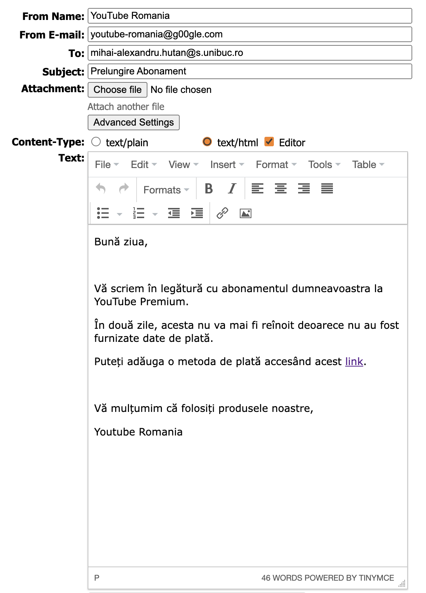
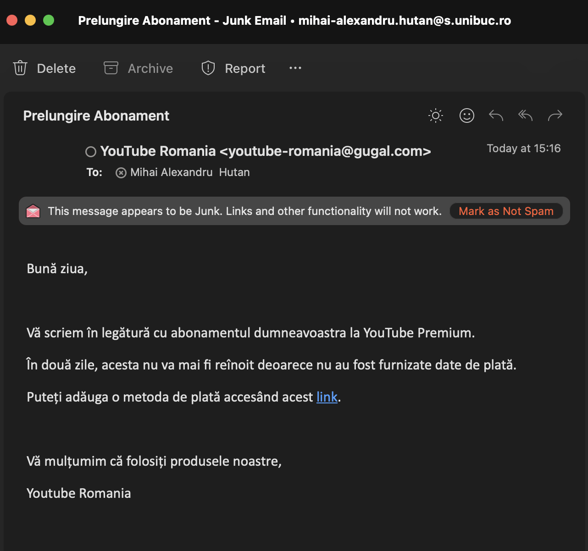
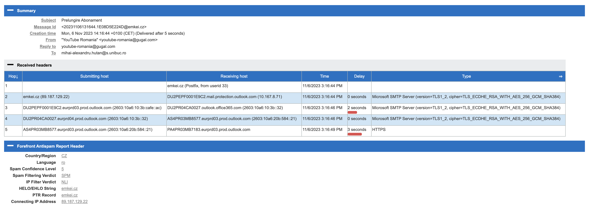
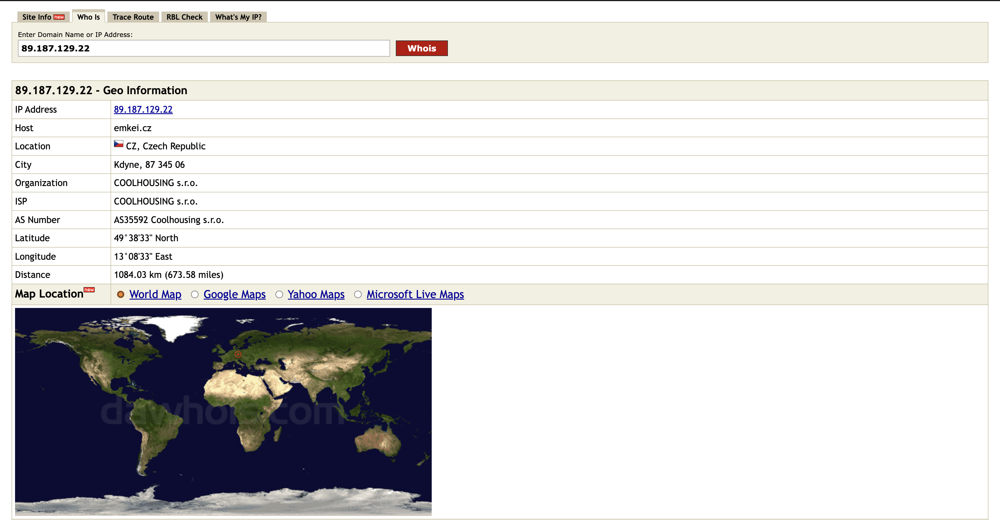
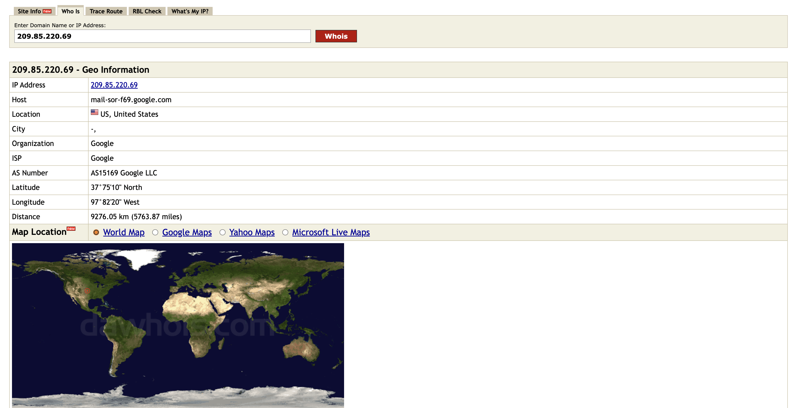
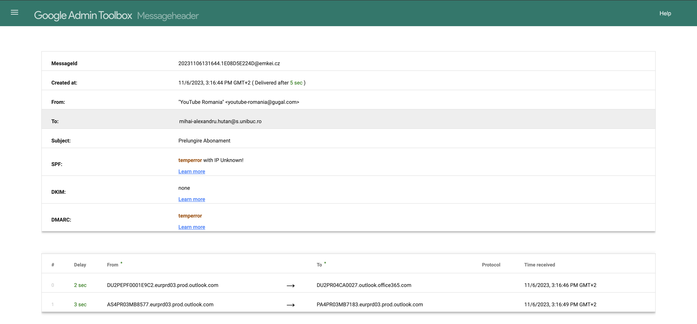
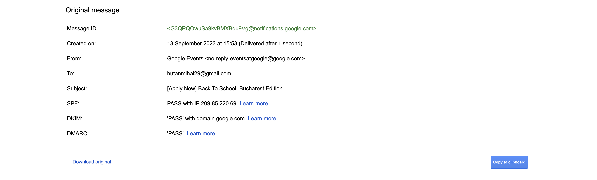

# - Laboratorul 4 -

## Phishing

### 1. Noțiuni generale

- (A)Inginerie socială - (4) O încercare de a păcăli pe cineva să dezvăluie informații (de exemplu, o parolă) care pot
  fi folosite pentru a ataca sisteme sau rețele.
- (B) Phishing -> (2) O tehnică pentru încercarea de a achiziționa date sensibile, cum ar fi numerele de cont bancar,
  printr-o solicitare frauduloasă prin e-mail sau pe un site web, în care făptuitorul se maschează ca o afacere legitimă
  sau o persoană de încredere.
- (C) Whaling -> (1) Un tip specific de phishing care vizează membrii de rang înalt ai organizațiilor.
- (D) Pharming -> (3) Utilizarea mijloacelor tehnice pentru a redirecționa utilizatorii către accesarea unui site Web
  fals, mascat drept unul legitim și divulgarea informațiilor personale.
- (E) Spear phishing -> (6) Un termen colocvial care poate fi folosit pentru a descrie orice atac de phishing foarte
  vizat.
- (F) Spoofing -> (5) Falsificarea adresei de trimitere a unei transmisii pentru a obține intrarea ilegală într-un
  sistem securizat.

### 2. Identificarea vizuală a unui atac de tip phishing

1. Titlul mesajului „mesaj important(1) : ING.ro” sugereaza un clickbait.
2. Email-ul a fost identificat ca junk.
3. Email-ul expeditorului „mbm@externalys.net” are un domeniu necunoscut și nesugestiv, spre deosebire de băncile
   adevărate care au, de regulă, domeniul format chiar din numele lor.
4. În email se cere conectarea la un cont pentru a finaliza o înregistrare (în mod normal, confirmările email-urilor
   constă doar în accesarea unui link). Mai mult decât atât, pentru a ajunge la așa-zisa pagină de conectare, este
   necesară apăsarea unui buton portocaliu cu mesajul „Valida”, unul nesugestiv și lipsit de sens.

### 3. Analiza e-mailurilor de tip phishing

- În cazul în care atacul ar avea succes, aș putea obține detaliile cardului persoanei păcălite și alte posibile date
  personale pe care le-aș putea cere înainte de „efectuarea plății”.

- Obtinem IP-ul de pe care a fost trimis email-ul fake:
  

- IP Email fake:
  
- IP Email adevarat:
  

- Email fake:
  
- Email adevarat:
  
