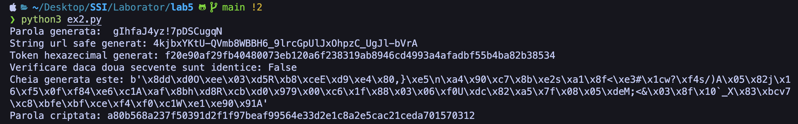
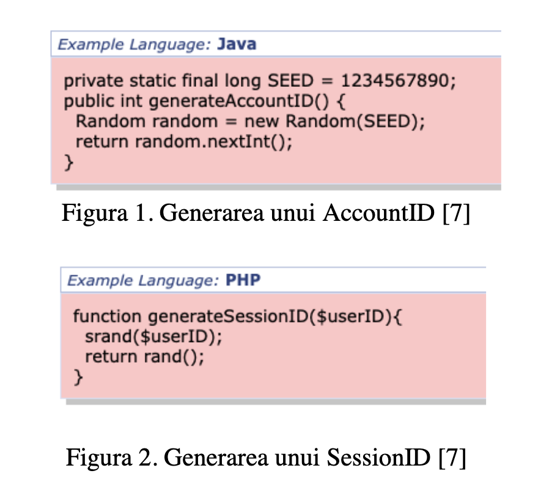

# - Laboratorul 5 -

## Generatoare de numere pseudo-aleatoare (PRG)

### 1. Noțiuni introductive

- Candidate 1 -> returneaza 0 (converge spre 0)
- Candidate 2 -> converge spre infinit - crestere liniara usor predictibila
- Candidate 3 -> returneaza un singur rezultat - output > input

### 2. Secrets.py



```python
import string
import secrets
import hashlib
import random

'''
Generează  o  parolă  de minim 10 caractere care conține  cel puțin o literă mare, o 
literă mică, o cifră și un caracter special (.!$@).  
La ce poate să folosească într-o aplicație informatică această funcționalitate? Dați 
exemplu de un scenariu de utilizare.
# Utilizare: generare parola sigura.
'''
while True:
    password = ""
    random_integer = random.randint(10, 20)
    for i in range(random_integer):
        password += secrets.choice(string.ascii_letters + string.digits + ".!$@")

    print("Parola generata: ", password)
    break

random_integer = random.randint(32, 40)

'''
Generează un string URL-safe de (cel puțin) 32 caractere.  
La ce poate să folosească într-o aplicație informatică această funcționalitate? Dați 
exemplu de un scenariu de utilizare.
# Utilizare: forgot password, confirm email.
'''
print(f"String url safe generat: {secrets.token_urlsafe(random_integer)}")

'''
Generează un token hexazecimal de (cel puțin) 32 cifre hexazecimale. 
La ce poate să folosească într-o aplicație informatică această funcționalitate? Dați 
exemplu de un scenariu de utilizare (diferit de scenariul anterior). 
# Utilizare: sistem de autentificare.
'''
print(f"Token hexazecimal generat: {secrets.token_hex(random_integer)}")

'''
Verifică dacă 2 secvențe sunt identice sau nu, minimizând riscul unui atac de timp 
(timing attack).
'''
print(
    f"Verificare daca doua secvente sunt identice: {secrets.compare_digest(secrets.token_hex(32), secrets.token_hex(32))}")

'''
Generează o  cheie  fluidă  binară  care ulterior să poată fi folosită pentru criptarea 
unui mesaj de 100 caractere.
# Utilizare: criptarea unui mesaj.
'''
print(f"Cheia generata este: {secrets.token_bytes(100)}")

'''
Stochează parole folosind un modul / o librărie care să ofere un nivel suficient de 
securitate. Ce ați folosit? De ce?
# Utilizare: prevenirea spargerii conturilor
'''
raw_password = "parola"
hashed_password = hashlib.sha256(raw_password.encode('utf-8')).hexdigest()
print(f"Parola criptata: {hashed_password}")

```

### 3. CVE, CWE, CAPEC

- Ce problemă identificați în următoarele secvențe de cod?
  

```
Figura 1 (Java): Spatiul de seed-uri limitat (unul singur), deci sanse mari de a fi ghicit seed-ul. + Seed usor predictibil + Seed unic.

Figura 2 (PHP): Seed-ul PRNG-ului nu se modifica, acesta fiind acelasi cu id-ul userului, astfel id-ul sesiunii va fi mereu acelasi si sistemul devine vurnelabil.
```

- Care este CWE ID asociat scenariilor de mai sus si problemei pe care acestea o ridică?  
  ID= 336 ([definitie](https://cwe.mitre.org/data/definitions/336.html)).

- Ce se întâmplă dacă nu se folosește același seed de fiecare dată, dar spațiul seed-urilor posibile este mic? Puteți
  găsi un CWE ID corespunzător acestui caz?
  Spatiul seed-urilor care este mai mic : Small Seed Space in
  PRNG ([CWE-339](https://cwe.mitre.org/data/definitions/339.html)) => un numar mai mic de posibile valori => sanse mai
  mari de un atac brute force reusit.

- Căutați atacul identificat la punctul precedent în [5]. Identificați și aici o mențiune la seed?
  CAPEC-112 -> [brute force](https://capec.mitre.org/data/definitions/112.html)

- Găsiți alte utilizări defectuoase ale PRG explicate în alte CWE-uri. Există CVE-uri corespunzătoare acestora?  
  [338](https://cwe.mitre.org/data/definitions/338.html) - The product uses a Pseudo-Random Number Generator (PRNG) in a
  security context, but the PRNG's algorithm is not cryptographically strong.
  [335](https://cwe.mitre.org/data/definitions/335.html) - The product uses a Pseudo-Random Number Generator (PRNG) but
  does not correctly manage seeds.

- Căutați înregistrări CVE care se referă la vulnerabilități în legătură cu PRG. Câte ați identificat ca fiind definite
  în acest an?
  https://www.cve.org/CVERecord?id=CVE-2023-2884
