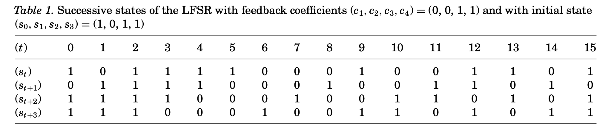

# - Laboratorul 6 -

## Sisteme de criptare simetrice

### 1. Linear Feedback Shift Registers (LFSRs)

```python
def lfsr(coefficients, state):
    period = 0
    initial_state = state.copy()
    output = []
    output.append(state[0])

    print(state)

    while True:
        # Varianta 1
        feedback = sum(c * s for c, s in zip(coefficients, state)) % 2
        state = [feedback] + state[:-1]  # Adaugam feedback-ul la inceputul listei si eliminam ultimul element

        # Varianta 2
        # feedback = sum(c * s for c, s in zip(coefficients, state[::-1])) % 2
        # state = state[1:] + [feedback]

        period += 1
        print(state)

        output.append(state[0])

        if state == initial_state:
            break

    print("Secvența de ieșire este:", output)
    return period


if __name__ == "__main__":
    # Citirea lungimii registrelor de la tastatură
    L = int(input("Introduceți lungimea registrelor (L): "))

    # Citirea coeficienților și stării inițiale de la tastatură
    coefficients = [int(input(f"Introduceți coeficientul c{i + 1}: ")) for i in range(L)]
    state = [int(input(f"Introduceți starea inițială s{i}: ")) for i in range(L)]

    # Generarea și afișarea secvenței de ieșire și valoarea perioadei
    period = lfsr(coefficients, state)
    print(f"Valoarea perioadei este: {period}")
```



```
Rezultatul rularii pe exemplul din tabelul 1:
Secvența de ieșire este: [1, 0, 1, 1, 1, 1, 0, 0, 0, 1, 0, 0, 1, 1, 0, 1]
Valoarea perioadei este: 15
```

### 2. Advanced Encryption Standard (AES)

```python
from Crypto.Cipher import AES

key = b'O cheie oarecare'
data = b'testtesttesttesttesttesttesttesttesttesttesttest'

cipher = AES.new(key, AES.MODE_ECB)
ciphertext = cipher.encrypt(data)

print(ciphertext)
```

- Executați secvența de mai sus. Ce obțineți?

```
b'\x88\x10\x86\xe2\xf3\xaai)\x9fz\xcb\xf0h4\xa4\xec\x88\x10\x86\xe2\xf3\xaai)\x9fz\xcb\xf0h4\xa4\xec\x88\x10\x86\xe2\xf3\xaai)\x9fz\xcb\xf0h4\xa4\xec'
```

- Ce mod de operare este folosit? Ce observați?

```
Algoritmul dat foloseste modul de operare ECB (Electronic Code Book).
Acest mod opereaza pe blocuri de dimensiune fixa (16 octeti), deci datele noastre trebuie sa aiba dimensiunea multiplu de 16 pentru a putea folosi acest mod.
```

- Ați recomanda folosirea modului de operare de la b)? De ce? De ce nu?

```
Nu, modul de operare ECB este nesigur deoarece texte identice sunt codate exact la fel, indiferent de lungimea lor. Astfel un atacator poate observa modele intre mesaje criptate. Exemplu:

b'testtesttesttesttesttesttesttesttesttesttesttesttesttesttesttest'

b'testtesttesttesttesttesttesttesttesttesttesttest'

b'\x88\x10\x86\xe2\xf3\xaai)\x9fz\xcb\xf0h4\xa4\xec\x88\x10\x86\xe2\xf3\xaai)\x9fz\xcb\xf0h4\xa4\xec\x88\x10\x86\xe2\xf3\xaai)\x9fz\xcb\xf0h4\xa4\xec\x88\x10\x86\xe2\xf3\xaai)\x9fz\xcb\xf0h4\xa4\xec'
b'\x88\x10\x86\xe2\xf3\xaai)\x9fz\xcb\xf0h4\xa4\xec\x88\x10\x86\xe2\xf3\xaai)\x9fz\xcb\xf0h4\xa4\xec\x88\x10\x86\xe2\xf3\xaai)\x9fz\xcb\xf0h4\xa4\xec'

```

- Care este dimensiunea cheii? Dar a blocului?

```
Dimensiunea cheii si a blocului este de 16.
```

- Modificați codul astfel încât să funcționeze dacă se înlocuiește valoarea data cu data=b'test'

```python
from Crypto.Cipher import AES
from Crypto.Util.Padding import pad

key = b'O cheie oarecare'
data = b'test'

# Adaugăm padding la data pentru a fi multiplu de 16
data = pad(data, AES.block_size)

cipher = AES.new(key, AES.MODE_ECB)
ciphertext = cipher.encrypt(data)

print(ciphertext)
```

- Refaceți codul, schimbând modul de operare cu un alt mod de operare pe care îl considerați mai potrivit.

```python
from Crypto.Cipher import AES

# Am folosit modul de operare CCM ce suporta blocuri de orice dimensiune si nu necesita padding.

key = b'O cheie oarecare'
data = b'test'

cipher = AES.new(key, AES.MODE_CCM)
ciphertext = cipher.encrypt(data)

print(ciphertext)
```

### 3. Atacul Meet-in-the-Middle

<!-- TODO -->

```python
from Crypto.Cipher import DES

# key1 = b'\x?0\x00\x00\x00\x00\x00\x00\x00'
# key2 = b'\x?0\x00\x00\x00\x00\x00\x00\x00'
#
# cipher1 = DES.new(key1, DES.MODE_ECB)
# cipher2 = DES.new(key2, DES.MODE_ECB)

PLAINTEXT = b'Provocare MitM!!'
# ciphertext = cipher2.encrypt(cipher1.encrypt(plain_text_val))

# Solution starts here
SUFFIX = b'\x00\x00\x00\x00\x00\x00\x00'
CIPHERTEXT = b"G\xfd\xdfpd\xa5\xc9'C\xe2\xf0\x84)\xef\xeb\xf9"


def encrypt_text(val, plaintext=PLAINTEXT):
    val = val * 16
    key = bytes([val]) + SUFFIX  # Transform the value in bytes and concatenate it with the suffix
    cipher = DES.new(key, DES.MODE_ECB)
    return cipher.encrypt(plaintext)


def decrypt_text(val, ciphertext=CIPHERTEXT):
    val = val * 16
    key = bytes([val]) + SUFFIX  # Transform the value in bytes and concatenate it with the suffix
    cipher = DES.new(key, DES.MODE_ECB)
    return cipher.decrypt(ciphertext)


def mitm():
    dictionary = {}
    candidates = []

    # Encrypt the plaintext with all the possible keys and store the result in a dictionary
    for key in range(16):
        code = str(encrypt_text(key))
        if code not in dictionary:
            dictionary[code] = key

    for key2 in range(16):
        intermediate_result = str(decrypt_text(key2))

        if intermediate_result in dictionary:
            candidate = (key2, dictionary[intermediate_result])

            if decrypt_text(candidate[1], decrypt_text(candidate[0])) == PLAINTEXT:
                candidates.append(candidate)

    if len(candidates) == 0:
        return None
    return candidates


if __name__ == '__main__':
    response = mitm()

    if response is None:
        exit("Not found!")

    for key in response:
        print("Cheile sunt: ")
        key1_int = key[0]
        key2_int = key[1]
        key1 = key[0] * 16
        key2 = key[1] * 16
        print(bytes([key1]) + SUFFIX)
        print(bytes([key2]) + SUFFIX)

        print("Deci semnele intrebarii sunt inlocuite de cifrele hexa:")
        print(key1_int, key2_int)

    # MiTM cripteaza si decripteaza cate 2^k+1 key. In total au fost testate 32 de chei.
```
