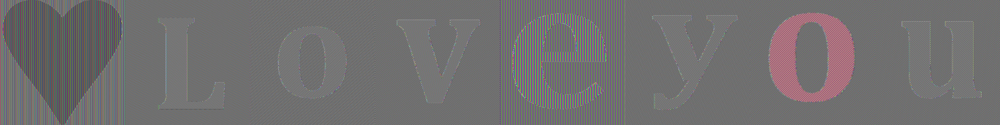
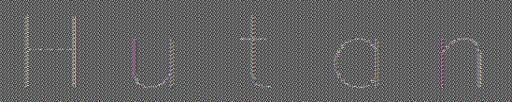

# Proiect SSI

### Cerinta 1

Link-ul catre cerinta poate fi gasit [aici](https://nsucrypto.nsu.ru/archive/2023/round/1/section/2/task/3/#data/).

### Solutie 1

- Mesajul decriptat este:
  

- Codul sursa pentru decriptare este:

```python
import os
import hashlib
import cv2 as cv

CURRENT_DIRECTORY = os.getcwd()  # get the current directory
ENCRYPTED_FILES_DIR = CURRENT_DIRECTORY + '/encrypted_files/'  # get the path to the encrypted_files directory
DECRYPTED_FILES_DIR = CURRENT_DIRECTORY + '/decrypted_files/'  # get the path to the decrypted_files directory
DECRYPTED_MESSAGE_FILE = CURRENT_DIRECTORY + '/decrypted_message.jpg'  # get the path to the decrypted message file
HASH_VALUES = [
    '602a4a8fff652291fdc0e049e3900dae608af64e5e4d2c5d4332603c9938171d',
    'f40e838809ddaa770428a4b2adc1fff0c38a84abe496940d534af1232c2467d5',
    'aa105295e25e11c8c42e4393c008428d965d42c6cb1b906e30be99f94f473bb5',
    '70f87d0b880efcdbe159011126db397a1231966991ae9252b278623aeb9c0450',
    '77a39d581d3d469084686c90ba08a5fb6ce621a552155730019f6c02cb4c0cb6',
    '456ae6a020aa2d54c0c00a71d63033f6c7ca6cbc1424507668cf54b80325dc01',
    'bd0fd461d87fba0d5e61bed6a399acdfc92b12769f9b3178f9752e30f1aeb81d',
    '372df01b994c2b14969592fd2e78d27e7ee472a07c7ac3dfdf41d345b2f8e305'
]


def init_dirs():
    # Create the 'encrypted_files' directory if it doesn't exist
    if not os.path.exists(ENCRYPTED_FILES_DIR):
        os.makedirs(ENCRYPTED_FILES_DIR)

    # Create the 'decrypted_files' directory if it doesn't exist
    if not os.path.exists(DECRYPTED_FILES_DIR):
        os.makedirs(DECRYPTED_FILES_DIR)


def read_image_bytes(file_path: str) -> bytes:
    """
    Reads the bytes from a ppm file
    :param file_path:
    :return:
    """
    with open(file_path, 'rb') as image:
        image = image.read()
    return image


def read_all_encrypted_ppm_files() -> list[tuple[str, bytes]]:
    """
    Reads all encrypted ppm files from the encrypted_files directory
    :return: a list of tuples containing the image name and the image content
    :return:
    """

    encrypted_ppm_images = []

    # get all the files from the encrypted_files directory and make sure we only read ppm files (not .DS_Store)
    files = [f for f in os.listdir(ENCRYPTED_FILES_DIR) if f.endswith(".ppm")]

    for encrypted_image_name in files:
        path = f'{ENCRYPTED_FILES_DIR}/{encrypted_image_name}'  # get the path to the current image
        image = read_image_bytes(path)
        encrypted_ppm_images.append((encrypted_image_name, image))

    return encrypted_ppm_images


def brute_force_hash_values() -> list[tuple[str, bytes, int]]:
    """
    Brute forces the hash values and return a list of tuples containing the hash value, the header and the image size
    :return: a list of tuples containing the hash value, the header and the image size
    """
    values = []
    for x in range(0, 1000):
        for y in range(0, 1000):
            oneline_header = f'P6 {x} {y} 255'  # create the header
            actual_header = f'P6\n{x} {y}\n255\n'.encode('UTF-8')  # create the actual header (with newlines)
            image_size = x * y  # used later for sorting
            new_hash_value = hashlib.sha256(oneline_header.encode('UTF-8')).hexdigest()  # hash the header
            for hash_value in HASH_VALUES:
                if hash_value == new_hash_value:  # if the hash value matches one of the hash values from the list
                    values.append((hash_value, actual_header, image_size))  # add it to the list
                if len(values) == len(HASH_VALUES):
                    return values  # early return the list if we found all the hash values
    return values


def write_ppm(file_path: str, header: bytes, image_bytes: bytes):
    with open(file_path, 'wb') as ppm_file:
        ppm_file.write(header + image_bytes)


def concat_decrypted_images_and_show_them():
    # Get a list of all PPM files in the decrypted folder
    ppm_files = [f for f in os.listdir(DECRYPTED_FILES_DIR) if f.endswith(".ppm")]

    # Sort the files to maintain the order
    ppm_files.sort()

    images = []

    common_width = 400
    common_height = 400

    # Read the images and concatenate them horizontally
    for ppm_file in ppm_files:
        image = cv.imread(os.path.join(DECRYPTED_FILES_DIR, ppm_file))

        # Resize each image to the common dimensions
        resized_image = cv.resize(image, (common_width, common_height))

        images.append(resized_image)
    concatenated_image = cv.hconcat(images)

    # Display the concatenated image
    cv.imshow("Secret", concatenated_image)
    cv.waitKey(0)
    cv.destroyAllWindows()

    # Save the concatenated image
    cv.imwrite(DECRYPTED_MESSAGE_FILE, concatenated_image)


if __name__ == '__main__':
    init_dirs()

    encrypted_images: list[tuple[str, bytes]] = read_all_encrypted_ppm_files()
    headers_dict: list[tuple[str, bytes, int]] = brute_force_hash_values()

    # Sort the headers based on the image size
    sorted_headers = sorted(headers_dict, key=lambda x: x[2])
    # Sort the images based on the image size
    sorted_images = sorted(encrypted_images, key=lambda x: len(x[1]))

    # Zip the sorted headers and images and that way we match the correct header with the correct image
    zip_list = zip(sorted_headers, sorted_images)

    for (hash_value, header, image_size), (image_name, image_bytes) in zip_list:
        new_image_name = image_name.replace('encr', 'decr')
        write_ppm(f'{DECRYPTED_FILES_DIR}{new_image_name}', header, image_bytes)

    concat_decrypted_images_and_show_them()
```

### Cerinta 2

Folosind aceeasi strategie ca cea a lui Bob, criptati numele vostru litera cu litera extr agand antetul imaginii din
fisier. Puteti utiliza orice cifru bloc existent. Prezentati problema creatt̆a.

### Solutie 2

- Mesajul decriptat dupa propria criptare este:
  

- Header-ele hash-uite ale imaginilor sunt:

  ```text
  b609076aab4c52c1fd0e87c939a7a82c15caaadec0fbcd0f4c599b29deeccd4a
  b609076aab4c52c1fd0e87c939a7a82c15caaadec0fbcd0f4c599b29deeccd4a
  b609076aab4c52c1fd0e87c939a7a82c15caaadec0fbcd0f4c599b29deeccd4a
  b609076aab4c52c1fd0e87c939a7a82c15caaadec0fbcd0f4c599b29deeccd4a
  b609076aab4c52c1fd0e87c939a7a82c15caaadec0fbcd0f4c599b29deeccd4a
  ```

- Acestea sunt identice deoarece header-ele sunt hardcodate cu valoarea 300x300 si 255 de culori.


- Codul sursa pentru acest exercitiu este:

```python
import os

import cv2
import numpy as np
import hashlib

from Crypto.Cipher import AES
from Crypto.Util.Padding import pad
import secrets

CURRENT_DIRECTORY = os.getcwd()  # get the current directory
ENCRYPTED_FILES_DIR = CURRENT_DIRECTORY + '/encrypted_files/'  # get the path to the encrypted_files directory
# get the path to the encrypted_files directory
ENCRYPTED_FILES_WITH_HEADER_DIR = CURRENT_DIRECTORY + '/encrypted_files_with_header/'
DECRYPTED_FILES_DIR = CURRENT_DIRECTORY + '/decrypted_files/'  # get the path to the decrypted_files directory
DECRYPTED_MESSAGE_FILE = CURRENT_DIRECTORY + '/decrypted_message.jpg'  # get the path to the decrypted message file
HASH_VALUES_FILE = CURRENT_DIRECTORY + '/hash_values.txt'  # get the path to the hash values file
KEY = secrets.token_bytes(16)  # generate a random key

print(f"Random key in hexadecimal: {KEY.hex()}")


def init_dirs():
    # Create the 'encrypted_files' directory if it doesn't exist
    if not os.path.exists(ENCRYPTED_FILES_DIR):
        os.makedirs(ENCRYPTED_FILES_DIR)

    # Create the 'decrypted_files' directory if it doesn't exist
    if not os.path.exists(DECRYPTED_FILES_DIR):
        os.makedirs(DECRYPTED_FILES_DIR)

    # Create the 'encrypted_files_with_header' directory if it doesn't exist
    if not os.path.exists(ENCRYPTED_FILES_WITH_HEADER_DIR):
        os.makedirs(ENCRYPTED_FILES_WITH_HEADER_DIR)


def read_image_bytes(file_path: str) -> bytes:
    """
    Reads the bytes from a ppm file
    :param file_path:
    :return:
    """
    with open(file_path, 'rb') as image:
        image = image.read()
    return image


def create_decrypted_ppms(name: str) -> None:
    """
    Creates a ppm file for each letter in the name
    :param name:
    :return:
    """
    counter = 1
    for letter in name:
        ppm_image = create_ppm_image(letter)
        cv2.imwrite(f"{DECRYPTED_FILES_DIR}File{counter}_decr.ppm", ppm_image)
        counter += 1


def create_ppm_image(letter: str) -> np.ndarray:
    """
    Creates a ppm image with the given letter
    :param letter:
    :return:
    """
    canvas_size = (300, 300)
    image = np.ones((canvas_size[0], canvas_size[1], 3), dtype=np.uint8) * 255  # White background

    font = cv2.FONT_HERSHEY_SIMPLEX
    font_scale = 10
    font_thickness = 2

    (text_width, text_height), baseline = cv2.getTextSize(letter, font, font_scale, font_thickness)
    position = ((canvas_size[0] - text_width) // 2, (canvas_size[1] + text_height) // 2)

    cv2.putText(image, letter, position, font, font_scale, (0, 0, 0), font_thickness, cv2.LINE_AA)

    return image


def read_all_ppm_files() -> list[tuple[str, bytes]]:
    """
    Reads all decrypted ppm files from the decrypted_files directory
    :return: a list of tuples containing the image name and the image content
    :return:
    """

    decrypted_ppm_images = []

    # get all the files from the encrypted_files directory and make sure we only read ppm files (not .DS_Store)
    files = [f for f in os.listdir(DECRYPTED_FILES_DIR) if f.endswith(".ppm")]

    for decrypted_image_name in files:
        path = f'{DECRYPTED_FILES_DIR}{decrypted_image_name}'  # get the path to the current image
        image = read_image_bytes(path)
        decrypted_ppm_images.append((decrypted_image_name, image))

    return decrypted_ppm_images


def extract_headers_and_hash_them(ppm_images: list[tuple[str, bytes]]) -> list[tuple[str, str, bytes, bytes]]:
    """
    Extracts the headers from the ppm images and hashes them
    :param ppm_images:
    :return: a list of tuples containing the image name, the hash value, content and the actual header
    """
    values = []
    for image_name, image_content in ppm_images:
        header = image_content.split(b'\n', 3)
        oneline_header = header[0] + header[1] + header[2]
        actual_header = header[0] + b'\n' + header[1] + b'\n' + header[2] + b'\n'
        values.append((image_name, hashlib.sha256(oneline_header).hexdigest(), header[3], actual_header))
    return values


def encrypt_ecb(data, key) -> bytes:
    """
    Encrypts the data using the ECB mode
    :param data:
    :param key:
    :return:
    """
    cipher = AES.new(key, AES.MODE_ECB)
    # pad the data to be a multiple of 16 bytes
    ciphertext = cipher.encrypt(pad(data, AES.block_size))
    return ciphertext


def write_files(values: list[tuple[str, str, bytes, bytes]]) -> None:
    """
    Writes the encrypted files and the hash values to the disk
    :param values:
    :return:
    """
    for name, hash, content, actual_header in values:
        name = name.replace("decr", "encr")  # replace the 'decr' part of the name with 'encr'
        with open(ENCRYPTED_FILES_DIR + name, "wb") as f:
            f.write(encrypt_ecb(content, KEY))
        with open(HASH_VALUES_FILE, "a") as f:
            f.write(hash + "\n")
        with open(ENCRYPTED_FILES_WITH_HEADER_DIR + name, "wb") as f:
            f.write(actual_header + encrypt_ecb(content, KEY))


def concat_decrypted_images_and_show_them():
    # Get a list of all PPM files in the folder
    ppm_files = [f for f in os.listdir(ENCRYPTED_FILES_WITH_HEADER_DIR) if
                 f.endswith(".ppm") and f.find("encr_without_header") == -1]

    # Sort the files to maintain the order
    ppm_files.sort()

    images = []

    common_width = 300
    common_height = 300

    # Read the images and concatenate them horizontally
    for ppm_file in ppm_files:
        image = cv2.imread(os.path.join(ENCRYPTED_FILES_WITH_HEADER_DIR, ppm_file))

        # Resize each image to the common dimensions
        resized_image = cv2.resize(image, (common_width, common_height))

        images.append(resized_image)
    concatenated_image = cv2.hconcat(images)

    # Display the concatenated image
    cv2.imshow("Secret", concatenated_image)
    cv2.waitKey(0)
    cv2.destroyAllWindows()

    # Save the concatenated image
    cv2.imwrite(DECRYPTED_MESSAGE_FILE, concatenated_image)


if __name__ == '__main__':
    init_dirs()

    my_name = "Hutan"

    # Generate ppm files for each letter in my name
    create_decrypted_ppms(my_name)

    # Read all ppm files
    ppm_images = read_all_ppm_files()

    dictionary = extract_headers_and_hash_them(ppm_images)
    write_files(dictionary)

    concat_decrypted_images_and_show_them()
```
